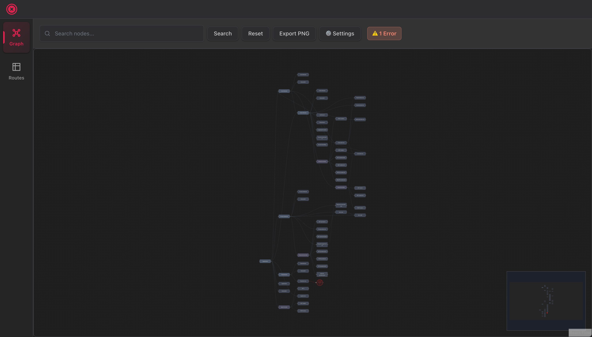
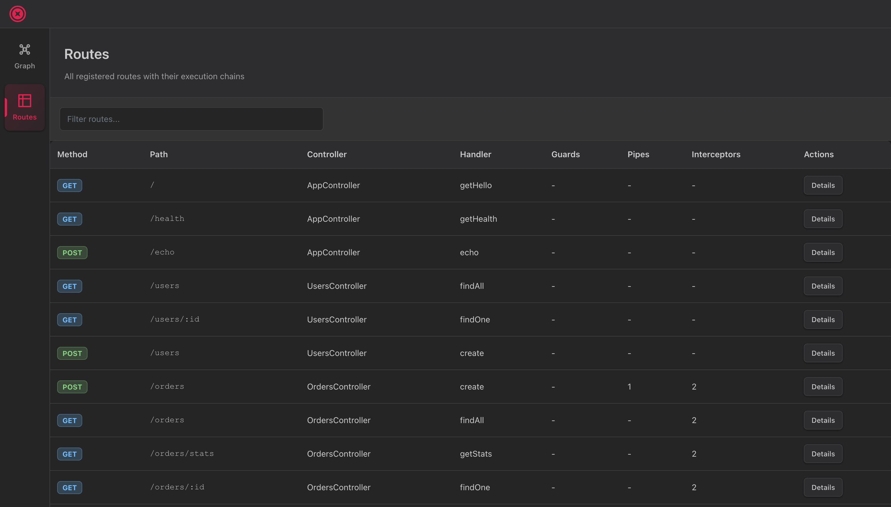

<div align="center">
  <h1>🔍 NestJS Graph Studio</h1>
  <p><strong>Local DevTools for NestJS Applications</strong></p>
  <p>Visualize your dependency injection graph, explore routes, and detect missing dependencies—all running locally with zero external dependencies.</p>

  [](https://www.npmjs.com/package/nestjs-graph-studio)
  [](https://github.com/Isqanderm/nestjs-graph-studio/actions)
  [](https://github.com/Isqanderm/nestjs-graph-studio)
  [](https://opensource.org/licenses/MIT)
  [](https://www.typescriptlang.org/)
  [](https://nodejs.org/)
</div>

---

## 📖 About

**NestJS Graph Studio** is a powerful local development tool designed specifically for NestJS applications. It provides an interactive web interface to visualize and understand your application's architecture, making it easier to debug dependency injection issues, explore route configurations, and maintain clean application structure.

Unlike cloud-based monitoring solutions, Graph Studio runs **entirely on your local machine**—no data leaves your development environment, no external services required, and no additional infrastructure to manage.

### Why NestJS Graph Studio?

- **🔍 Understand Complex Dependencies** - Instantly see how your modules, providers, and controllers are connected
- **🐛 Debug DI Issues Faster** - Automatically detect missing dependencies with actionable fix suggestions
- **🛣️ Explore Your API Surface** - Browse all routes with their complete execution chains (guards, pipes, interceptors)
- **🔒 Privacy First** - Everything runs locally, your code never leaves your machine
- **⚡ Zero Setup** - Just install the package and add one line to your module imports

## Screenshots

### DI Graph Visualization

*Interactive dependency injection graph with missing dependency detection*

### Route Explorer

*Browse all routes with their execution chains (guards, pipes, interceptors)*

## ✨ Features

### Core Capabilities

- **🔍 Interactive DI Graph Visualization**
  - Visual representation of your entire dependency injection graph
  - Pan, zoom, and navigate through complex module structures
  - Color-coded nodes by type (modules, providers, controllers, routes)
  - Export graph as PNG for documentation

- **🔴 Smart Missing Dependency Detection**
  - Automatically identifies missing or misconfigured dependencies
  - Highlights problematic nodes in red with clear visual indicators
  - Provides actionable fix suggestions (e.g., "Add UserService to the module's providers")
  - Helps prevent runtime DI errors before they happen

- **🛣️ Comprehensive Route Explorer**
  - Browse all registered HTTP routes in your application
  - View complete execution chains for each route:
    - Guards (authentication, authorization)
    - Pipes (validation, transformation)
    - Interceptors (logging, caching, transformation)
    - Exception filters (error handling)
  - Filter and search routes by method, path, or controller

- **📦 Privacy & Security**
  - Runs 100% locally on your development machine
  - No external API calls or cloud services
  - No telemetry or data collection
  - Perfect for sensitive or regulated projects

- **⚙️ Developer Experience**
  - Zero configuration required for basic usage
  - Works with both Express and Fastify adapters
  - TypeScript-first with full type definitions
  - Hot reload support during development
  - Minimal performance overhead

## 🚀 Quick Start

### Installation

Install the package using your preferred package manager:

```bash
# npm
npm install nestjs-graph-studio

# yarn
yarn add nestjs-graph-studio

# pnpm
pnpm add nestjs-graph-studio
```

### Basic Setup

Add `GraphStudioModule` to your root application module:

```typescript
import { Module } from '@nestjs/common';
import { GraphStudioModule } from 'nestjs-graph-studio';

@Module({
  imports: [
    // Enable Graph Studio in development only
    GraphStudioModule.forRoot({
      enabled: process.env.NODE_ENV !== 'production',
    }),
    // ... your other modules
  ],
})
export class AppModule {}
```

### Start Your Application

```typescript
import { NestFactory } from '@nestjs/core';
import { AppModule } from './app.module';

async function bootstrap() {
  const app = await NestFactory.create(AppModule);
  await app.listen(3000);

  console.log('🚀 Application: http://localhost:3000');
  console.log('🔍 Graph Studio: http://localhost:3000/graph-studio');
}

bootstrap();
```

### Access the UI

Open your browser and navigate to:

```
http://localhost:3000/graph-studio
```

You'll see two main views:
- **📊 Graph View** - Interactive visualization of your DI graph with pan/zoom controls
- **🛣️ Routes View** - Complete list of all registered routes with execution chains

That's it! You're ready to explore your NestJS application architecture.

## ⚙️ Configuration

### Basic Configuration

```typescript
GraphStudioModule.forRoot({
  enabled: true,              // Enable/disable the module
  healthPath: '/health',      // Health check endpoint path
})
```

### Configuration Options

| Option | Type | Default | Description |
|--------|------|---------|-------------|
| `enabled` | `boolean` | `false` in production, `true` otherwise | Enable or disable Graph Studio |
| `healthPath` | `string` | `'/health'` | Health check endpoint path (relative to `/graph-studio`) |


### Advanced Configuration

Use `forRootAsync()` for dynamic configuration with dependency injection:

```typescript
import { Module } from '@nestjs/common';
import { ConfigModule, ConfigService } from '@nestjs/config';
import { GraphStudioModule } from 'nestjs-graph-studio';

@Module({
  imports: [
    ConfigModule.forRoot(),
    GraphStudioModule.forRootAsync({
      inject: [ConfigService],
      useFactory: (config: ConfigService) => ({
        enabled: config.get('GRAPH_STUDIO_ENABLED', true),
        healthPath: config.get('GRAPH_STUDIO_HEALTH_PATH', '/health'),
      }),
    }),
  ],
})
export class AppModule {}
```

## 💡 Use Cases

### Development Environment

Perfect for understanding your application's dependency structure during development:

```typescript
GraphStudioModule.forRoot({
  enabled: process.env.NODE_ENV === 'development',
})
```

**Use for:**
- Understanding module dependencies when onboarding new team members
- Debugging circular dependency issues
- Visualizing the impact of architectural changes
- Documenting application structure

### Staging/Testing Environment

Enable for staging environments to verify DI configuration:

```typescript
GraphStudioModule.forRoot({
  enabled: process.env.NODE_ENV !== 'production',
})
```

**Use for:**
- Validating dependency injection before production deployment
- Testing route configurations
- Verifying guard/pipe/interceptor chains

### Production Debugging (Use with Caution)

Temporarily enable for production debugging when necessary:

```typescript
GraphStudioModule.forRoot({
  enabled: process.env.ENABLE_GRAPH_STUDIO === 'true',
})
```

**⚠️ Important:** Only enable in production when absolutely necessary and behind proper authentication/network security.

## 🔌 API Endpoints

When Graph Studio is enabled, the following endpoints are automatically registered:

| Endpoint | Method | Description |
|----------|--------|-------------|
| `/graph-studio` | GET | Graph Studio web UI |
| `/graph-studio/graph` | GET | DI graph snapshot (JSON) |
| `/graph-studio/routes` | GET | Routes metadata (JSON) |
| `/graph-studio/health` | GET | Health check endpoint |

### Example API Responses

**Graph Snapshot** (`GET /graph-studio/graph`):
```json
{
  "createdAt": "2025-10-31T12:00:00.000Z",
  "stats": {
    "modules": 5,
    "providers": 12,
    "controllers": 3,
    "routes": 8
  },
  "nodes": [...],
  "edges": [...],
  "routes": [...]
}
```

**Health Check** (`GET /graph-studio/health`):
```json
{
  "status": "ok",
  "timestamp": "2025-10-31T12:00:00.000Z"
}
```


## 📘 TypeScript Support

NestJS Graph Studio is written in TypeScript and provides full type definitions out of the box.

### Available Types

```typescript
import {
  // Module
  GraphStudioModule,

  // Configuration
  GraphStudioOptions,
  GraphStudioAsyncOptions,

  // Data Models
  GraphSnapshot,
  GraphNode,
  GraphEdge,
  RouteMeta,
  RouteChain,
  GraphStats,

  // Enums
  Scope,
  NodeType,
  Stage,
} from 'nestjs-graph-studio';
```

### Type Definitions

<details>
<summary>Click to expand type definitions</summary>

```typescript
// Configuration
interface GraphStudioOptions {
  enabled?: boolean;
  healthPath?: string;
}

interface GraphStudioAsyncOptions {
  useFactory: (...args: any[]) => Promise<GraphStudioOptions> | GraphStudioOptions;
  inject?: any[];
}

// Data Models
type Scope = 'SINGLETON' | 'REQUEST' | 'TRANSIENT';
type NodeType = 'MODULE' | 'PROVIDER' | 'CONTROLLER' | 'ROUTE' | 'MISSING';

interface GraphNode {
  id: string;
  name: string;
  type: NodeType;
  scope?: Scope;
  module?: string;
  route?: { method: string; path: string };
  missing?: { requiredBy: string[]; suggestedFix?: string };
}

interface GraphEdge {
  from: string;
  to: string;
  kind: 'import' | 'export' | 'injects' | 'handles' | 'missing';
}

interface RouteMeta {
  method: string;
  path: string;
  controller: string;
  handler: string;
  chain: RouteChain;
}

interface RouteChain {
  guards: string[];
  pipes: string[];
  interceptors: string[];
  filters: string[];
}

interface GraphStats {
  modules: number;
  providers: number;
  controllers: number;
  routes: number;
}
```

</details>

## 📋 Requirements

| Dependency | Version |
|------------|---------|
| **Node.js** | >= 18.0.0 |
| **NestJS** | >= 9.0.0 or >= 10.0.0 |
| **TypeScript** | >= 5.0.0 |
| **reflect-metadata** | >= 0.1.13 or >= 0.2.0 |

## ✅ Compatibility

### HTTP Adapters

| Adapter | Status | Notes |
|---------|--------|-------|
| **Express** | ✅ Fully Supported | Default NestJS adapter |
| **Fastify** | ✅ Fully Supported | High-performance alternative |

### NestJS Versions

| Version | Status | Notes |
|---------|--------|-------|
| **NestJS 9.x** | ✅ Fully Supported | Tested with 9.0.0+ |
| **NestJS 10.x** | ✅ Fully Supported | Tested with 10.0.0+ |

### Node.js Versions

| Version | Status | Notes |
|---------|--------|-------|
| **Node 18.x** | ✅ Fully Supported | LTS |
| **Node 20.x** | ✅ Fully Supported | LTS |
| **Node 22.x** | ✅ Fully Supported | Current |

## 🔧 Troubleshooting

### Graph Studio UI Not Loading

**Symptoms:** Navigating to `/graph-studio` shows a blank page or 404 error.

**Solutions:**
1. ✅ Verify `enabled: true` is set in your configuration
2. ✅ Check that your application is running on the expected port
3. ✅ Ensure you're navigating to the correct URL (default: `http://localhost:3000/graph-studio`)
4. ✅ Check browser console for JavaScript errors
5. ✅ Verify no other middleware is intercepting the `/graph-studio` path

### Missing Dependencies Not Detected

**Symptoms:** You know a dependency is missing, but it's not highlighted in the graph.

**How Detection Works:**
The module automatically detects missing dependencies by analyzing:
- Constructor injection parameters (`constructor(private service: MyService)`)
- Property injection decorators (`@Inject()`)
- Module imports/exports configuration

**Solutions:**
1. ✅ Ensure you're using standard NestJS dependency injection patterns
2. ✅ Check that the dependency is properly decorated with `@Injectable()`
3. ✅ Verify the dependency is declared in the correct module
4. ✅ For custom providers, ensure proper token configuration

### Performance Issues

**Symptoms:** Graph Studio UI is slow or unresponsive with large applications.

**Solutions:**
1. ✅ Use the search functionality to filter nodes instead of viewing the entire graph
2. ✅ Consider breaking down large modules into smaller, more focused modules
3. ✅ The graph uses virtualization for large datasets, but extremely large graphs (1000+ nodes) may still be slow

### TypeScript Compilation Errors

**Symptoms:** TypeScript errors when importing types from `nestjs-graph-studio`.

**Solutions:**
1. ✅ Ensure TypeScript version >= 5.0.0
2. ✅ Check that `reflect-metadata` is imported in your `main.ts`
3. ✅ Verify `tsconfig.json` has `"experimentalDecorators": true` and `"emitDecoratorMetadata": true`

## 🔒 Security Considerations

### Development-Only Tool

**⚠️ Important:** Graph Studio is designed for **local development only** and does not include authentication or authorization.

**Best Practice:**
```typescript
GraphStudioModule.forRoot({
  enabled: process.env.NODE_ENV !== 'production',
})
```

### Security Guidelines

| Environment | Recommendation | Rationale |
|-------------|----------------|-----------|
| **Development** | ✅ Enabled | Safe for local development |
| **Staging/Testing** | ⚠️ Use with caution | Only if network is secured |
| **Production** | ❌ Disabled | Exposes internal application structure |

### Network Security

**If you must expose Graph Studio:**
1. Use a reverse proxy with authentication (e.g., nginx with basic auth)
2. Restrict access by IP address
3. Use VPN or SSH tunneling
4. Enable only temporarily for debugging

**Example nginx configuration:**
```nginx
location /graph-studio {
    auth_basic "Graph Studio";
    auth_basic_user_file /etc/nginx/.htpasswd;
    proxy_pass http://localhost:3000/graph-studio;
}
```

### What Information is Exposed?

When Graph Studio is enabled, the following information is accessible:
- Module names and structure
- Provider/service names and dependencies
- Controller and route definitions
- Guard, pipe, interceptor, and filter names
- Dependency injection configuration

**Not exposed:**
- Source code
- Environment variables
- Database credentials
- Business logic implementation
- Request/response data

## 🤝 Contributing

We welcome contributions from the community! Whether it's bug fixes, new features, or documentation improvements, your help is appreciated.

### How to Contribute

1. **Fork the repository**
2. **Create a feature branch** (`git checkout -b feature/amazing-feature`)
3. **Make your changes** and add tests
4. **Run the test suite** (`npm run test:all`)
5. **Commit your changes** (`git commit -m 'Add some amazing feature'`)
6. **Push to your branch** (`git push origin feature/amazing-feature`)
7. **Open a Pull Request**

### Development Setup

```bash
# Clone the repository
git clone https://github.com/Isqanderm/nestjs-graph-studio.git
cd nestjs-graph-studio

# Install dependencies
npm install

# Run tests
npm run test          # Backend tests
npm run test:ui       # UI tests
npm run test:e2e      # E2E tests
npm run test:all      # All tests

# Build the project
npm run build

# Run the example application
npm run example:install
npm run example
```

For detailed contributing guidelines, see [CONTRIBUTING.md](CONTRIBUTING.md).

## 📄 License

This project is licensed under the **MIT License** - see the [LICENSE](LICENSE) file for details.

**TL;DR:** You can use this project for free in commercial and non-commercial projects. Attribution is appreciated but not required.

## 💬 Support & Community

### Get Help

- 📖 **[Documentation](https://github.com/Isqanderm/nestjs-graph-studio#readme)** - Comprehensive guides and API reference
- 🐛 **[Issue Tracker](https://github.com/Isqanderm/nestjs-graph-studio/issues)** - Report bugs or request features
- 💬 **[Discussions](https://github.com/Isqanderm/nestjs-graph-studio/discussions)** - Ask questions and share ideas

### Useful Links

- 🏠 [GitHub Repository](https://github.com/Isqanderm/nestjs-graph-studio)
- 📦 [npm Package](https://www.npmjs.com/package/nestjs-graph-studio)
- 📝 [Changelog](https://github.com/Isqanderm/nestjs-graph-studio/blob/main/CHANGELOG.md)
- 🎯 [Example Application](https://github.com/Isqanderm/nestjs-graph-studio/tree/main/example)

## 🙏 Acknowledgments

Built with:
- [NestJS](https://nestjs.com/) - A progressive Node.js framework
- [React](https://react.dev/) - UI library
- [ReactFlow](https://reactflow.dev/) - Graph visualization
- [Tailwind CSS](https://tailwindcss.com/) - Styling
- [Radix UI](https://www.radix-ui.com/) - UI primitives

## 📊 Project Stats

- **Test Coverage:** 93% (Backend) | 76% (UI)
- **Total Tests:** 406 (229 Backend + 177 UI)
- **Bundle Size:** ~50KB (gzipped)
- **Dependencies:** Zero runtime dependencies (peer dependencies only)

---

<div align="center">
  <strong>Made with ❤️ for the NestJS community</strong>
  <br />
  <sub>Star ⭐ this repository if you find it helpful!</sub>
</div>
